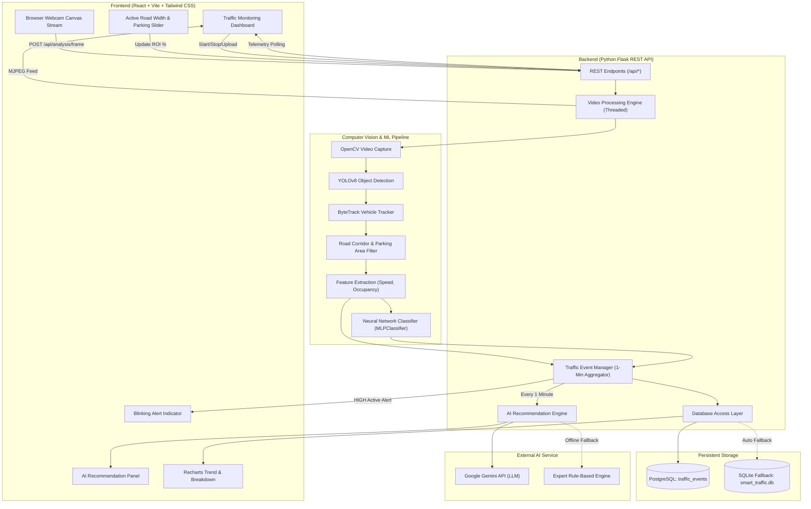

# SMART TRAFFIC CONGESTION PREDICTION AND MANAGEMENT SYSTEM
### Intelligent Transportation System (ITS) Enterprise Operations Platform

[](https://python.org)
[](https://reactjs.org)
[](https://vitejs.dev)
[](https://docs.ultralytics.com)
[](https://scikit-learn.org)
[](https://www.postgresql.org)

---

## 1. Executive Summary

The **Smart Traffic Congestion Prediction and Management System** is a professional, full-stack Intelligent Transportation System (ITS) platform. The application unifies **Computer Vision (YOLOv8 + ByteTrack)**, **Active Road Corridor & Parking Exclusion Filtering**, **Neural Network Congestion Classification**, **PostgreSQL Persistence**, and **Generative AI Decision Support** into a clean, modern operations dashboard.

### Core Features
1. **Dual Input Processing**: Processes both uploaded video files (MP4, AVI, MOV, WebM) and live camera streams (in-browser webcam or hardware CCTV device) through the same underlying AI vision pipeline.
2. **Configurable Road Width & Parking Exclusion**: Allows operators to set custom active corridor boundaries (Left and Right Parking Margins). Vehicles stationed in the parking zone are excluded from moving traffic counts, road occupancy, and congestion calculations.
3. **Vehicle Detection & Tracking**: Employs **Ultralytics YOLOv8n** to detect multi-class transit objects (*Car*, *Motorcycle*, *Bus*, *Truck*) and **ByteTrack** for persistent vehicle tracking IDs across frames.
4. **Estimated Velocity & Road Occupancy**: Calculates estimated vehicle velocity in pixels/second (`px/s`) and spatial road occupancy percentage (`%`) over the active road corridor.
5. **Neural-Network Congestion Prediction**: An **MLPClassifier (Multi-Layer Perceptron)** classifies corridor flow into **LOW**, **MEDIUM**, and **HIGH**.
6. **1-Minute Status Aggregation**: Aggregates continuous frame telemetry into discrete 1-minute historical intervals, preventing database bloating while preserving operational trends.
7. **Blinking Alert State Machine**: Triggers an alert banner during **HIGH** congestion. Clicking **[OK / ACKNOWLEDGE]** silences the alert and transitions the event state (`ACTIVE` → `ACKNOWLEDGED` → `CLOSED`).
8. **AI Decision Support**: Integrates an LLM Advisory Service (Google Gemini API with a domain-specific expert rule fallback) generating structured causal analysis and actionable traffic management steps.

---

## 2. System Architecture



---

## 3. Technology Stack

| Layer | Technologies Used |
| :--- | :--- |
| **Frontend UI** | React 19, Vite 8, Tailwind CSS v4, Lucide React Icons |
| **Data Visualizations** | Recharts (AreaChart, BarChart, ResponsiveContainer) |
| **Backend Web Server** | Python 3.10+, Flask 3.1, Flask-CORS, Werkzeug |
| **Computer Vision** | OpenCV (`cv2`), Ultralytics YOLOv8n, ByteTrack |
| **Machine Learning** | Scikit-learn (MLPClassifier), NumPy, Pandas, Joblib |
| **Database** | PostgreSQL with SQLAlchemy ORM (Automatic SQLite fallback) |
| **AI Advisory** | Google Gemini 1.5 Flash API (with Rule-Based Fallback) |

---

## 4. Setup and Installation

### Step 1: Navigate to Directory
```powershell
cd C:\Users\hp\.gemini\antigravity\scratch\smart-traffic-system
```

### Step 2: Install Backend Dependencies
```powershell
python -m pip install flask flask-cors requests joblib numpy pandas scikit-learn opencv-python ultralytics psycopg2-binary sqlalchemy python-dotenv
```

### Step 3: Install Frontend Dependencies
```powershell
cd frontend
npm install
cd ..
```

---

## 5. Running in Visual Studio Code (VS Code)

This repository includes pre-configured VS Code workspace configurations in `.vscode/launch.json` and `.vscode/tasks.json`.

### Option A: One-Click Run via VS Code Run & Debug (F5)
1. Open the project folder in VS Code:
   ```powershell
   code C:\Users\hp\.gemini\antigravity\scratch\smart-traffic-system
   ```
2. Click on the **Run and Debug** icon in the left activity bar (or press `Ctrl + Shift + D`).
3. Select **"Python: Start Traffic System Backend"** from the dropdown menu at the top.
4. Press `F5` (or click the green Play button).
5. Open your web browser at **`http://127.0.0.1:5000`** to view the live dashboard.

### Option B: Running from VS Code Integrated Terminal
Open a new integrated terminal (`Ctrl + ~`) in VS Code:

1. **Start Backend & Web Application**:
   ```powershell
   python backend/app.py
   ```
   *The Flask backend immediately serves the production React frontend on `http://127.0.0.1:5000`.*

2. **(Optional) Run Automated Test Suite**:
   ```powershell
   python test_system.py
   ```

3. **(Optional) Frontend Development Server (Hot-Reloading)**:
   ```powershell
   cd frontend
   npm run dev
   ```
   *Access hot-reloading dev server at `http://localhost:5173`.*

---

## 6. Configurable Road Width & Parking Exclusion

In many urban surveillance cameras, lateral segments of the frame cover designated street parking or non-moving shoulder zones. Vehicles positioned in these areas should not count toward active traffic density or trigger false bottlenecks.

### How It Works:
1. **Dynamic Corridor Boundaries**:
   - `roi_x_start_pct`: Sets the left boundary (0% to 40%).
   - `roi_x_end_pct`: Sets the right boundary (60% to 100%).
   - Midsection between the two is designated as the **Active Moving Corridor**.
2. **Detection Logic**:
   - Any vehicle whose centroid $(cx, cy)$ falls in the lateral parking margins is labeled as `[PARKED]` with a muted outline.
   - Parked vehicles are excluded from moving velocity averages, road occupancy percentages, and congestion classification.
3. **Interactive UI Control**:
   - Operators can adjust the width in real time using the interactive sliders or 1-click presets (*Full Road*, *Left Parking*, *Both Sides Parking*).

---

## 7. REST API Reference

| Endpoint | Method | Description |
| :--- | :---: | :--- |
| `/api/health` | `GET` | System health, model readiness, and active database engine. |
| `/api/video/upload` | `POST` | Uploads video (MP4/AVI) and extracts duration/metadata. |
| `/api/analysis/start` | `POST` | Starts processing on `VIDEO`, `CAMERA`, or `SAMPLE`. |
| `/api/analysis/pause` | `POST` | Pauses/resumes processing stream. |
| `/api/analysis/stop` | `POST` | Stops video analysis. |
| `/api/video/feed` | `GET` | MJPEG video stream with bounding boxes and parking boundaries. |
| `/api/analysis/frame` | `POST` | Ingests client webcam frame and returns real-time detection statistics. |
| `/api/traffic/current` | `GET` | Current telemetry, active alerts, and 1-minute interval progress. |
| `/api/traffic/history` | `GET` | Paginated 1-minute historical records with filtering. |
| `/api/events` | `GET` | Filtered list of traffic events (`ACTIVE`, `ACKNOWLEDGED`, `CLOSED`). |
| `/api/events/<id>/acknowledge`| `POST` | Silences active blinking alert and transitions status to `ACKNOWLEDGED`. |
| `/api/events/<id>/close` | `POST` | Manually marks event as `CLOSED`. |
| `/api/ai/recommendation` | `POST` | Generates structured causal analysis and actionable traffic steps. |
| `/api/analytics` | `GET` | Historical congestion ratios, vehicle breakdowns, and timeline trends. |
| `/api/settings` | `GET`/`POST`| Updates confidence threshold, aggregation interval, and road width ROI. |
